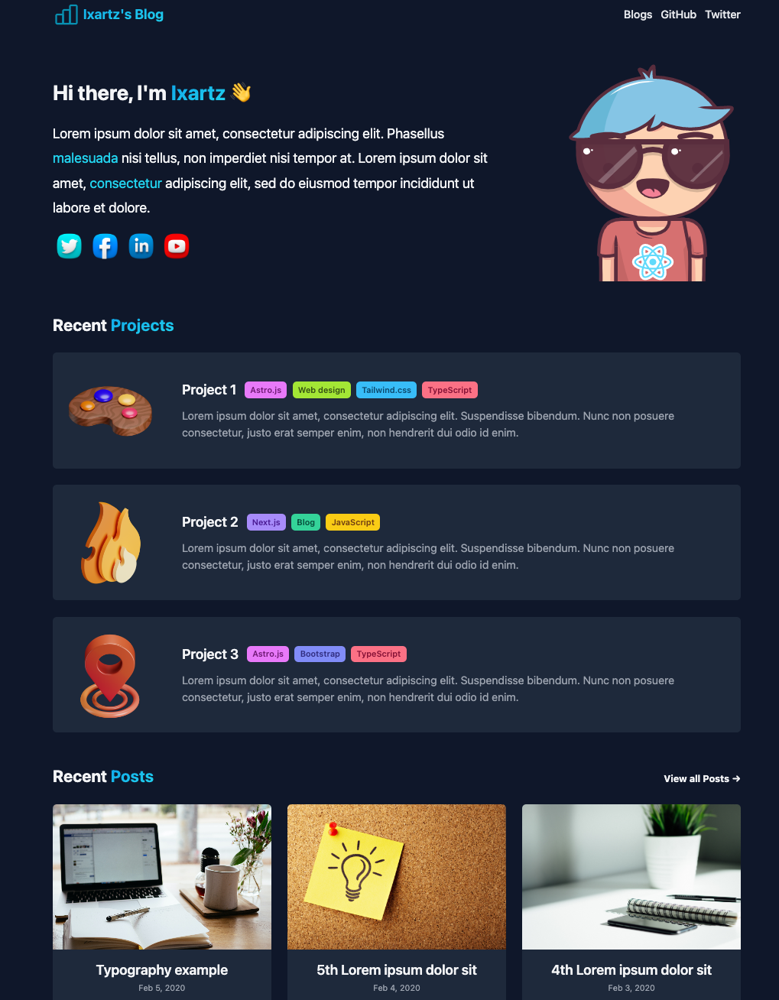
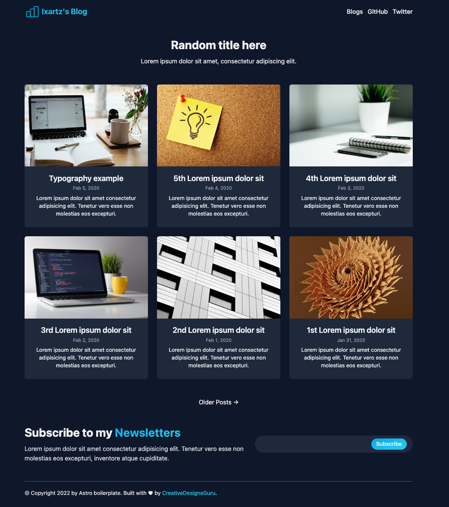
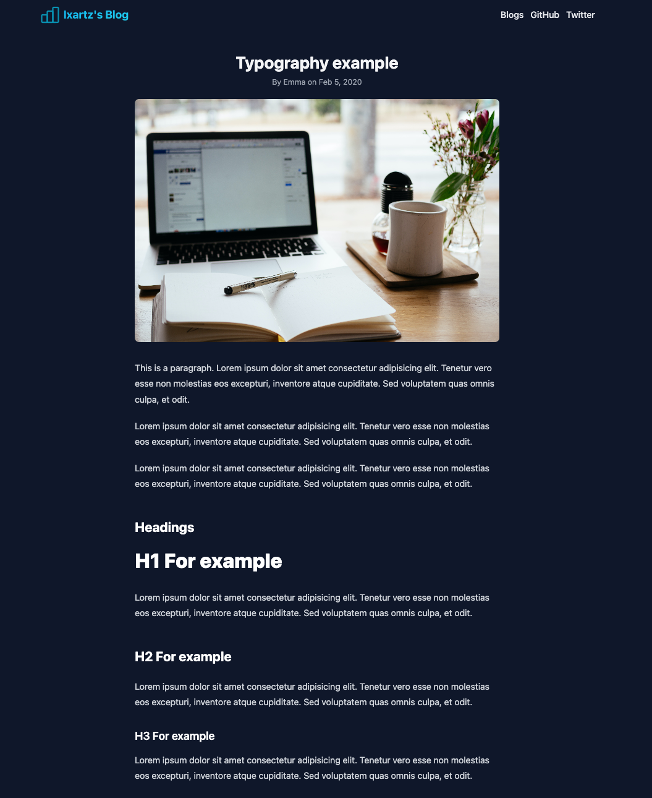

# Astro Boilerplate Demo

Exploring the capabilities of [Astro Boilerplate](https://github.com/ixartz/Astro-boilerplate) for a basic site/blog. Requirements are:
 * Dark/Light Mode
 * Support pages
 * Support blog
 * Have RSS feed
 * Good SEO
 * Markdown content authoring

---

## Setup

```
$ git clone --depth=1 https://github.com/ixartz/Astro-boilerplate astro-build-demo
$ cd my-project-name
$ npm install
..
..
7 vulnerabilities (5 moderate, 2 high)
To address all issues (including breaking changes), run:
  npm audit fix --force
```

For now, I ignored the audit and went ahead to preview the local dev version.

---

## Local Preview 

```
$ npm run dev

> astro-boilerplate@1.0.0 dev
> astro dev

  🚀  astro  v1.0.0-beta.44 started in 43ms
  
  ┃ Local    http://localhost:3000/
  ┃ Network  use --host to expose
  
  ▶ This is a  beta  prerelease build
    Feedback? https://astro.build/issues
```

## View Local Preview

Visit `http://localhost:3000/` on the browser. You should see this landing page.



Clicking `View all Posts` or `Blogs` gets you to this page:



And Clicking a listed blog post card gets you a page like this:



---
